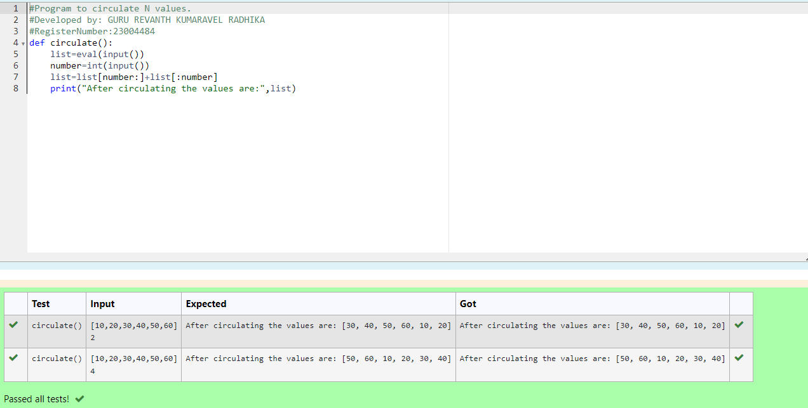

# Circulate-the-values-of-N-variables

## Aim:
To write a python program to circulate the n variables using function concept

## Equipment’s required:
PC
Anaconda - Python 3.7

## Algorithm: 
### Step 1:
Define the circulate function 
### Step 2: 
Accept a list from the user and evaluate it using eval
### Step 3: 
Get the value from the user for the number of rotation
### Step 4: 
Using the slicing concept rotate the list
### Step 5: 
Give print statement to print the list
### Step 6: 
Call the circulate function

## Program:
```
#Program to circulate N values.
#Developed by: GURU REVANTH KUMARAVEL RADHIKA
#RegisterNumber:23004484
def circulate():
    list=eval(input())
    number=int(input())
    list=list[number:]+list[:number]
    print("After circulating the values are:",list)
```

## Output:


## Result:
Thus the circulating n variables is executed successfully.
